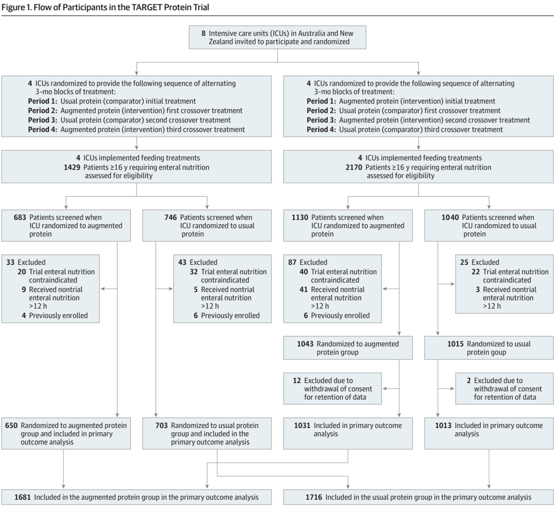
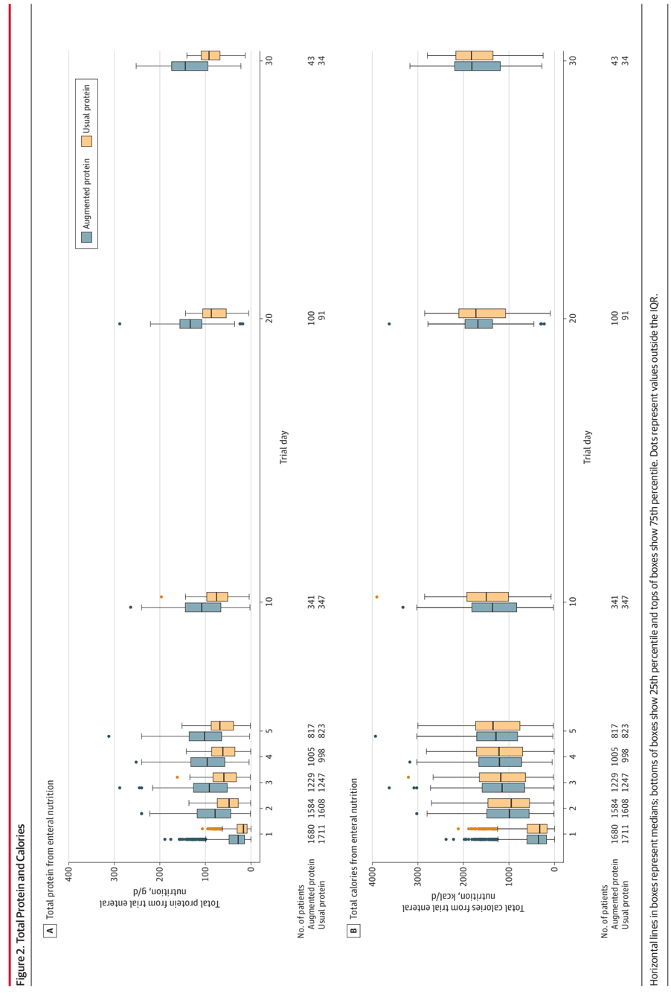
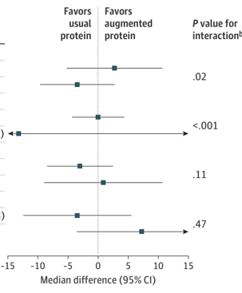

## JAMA | Original Investigation | CARING FOR THE CRITICALLY ILL PATIENT

## Augmented Enteral Protein During Critical Illness The TARGET Protein Randomized Clinical Trial

Matthew J. Summers, BSc, MDiet; Lee-anne S. Chapple, PhD; Amalia Karahalios, PhD; Rinaldo Bellomo, PhD; Marianne J. Chapman, PhD; Suzie Ferrie, PhD; Mark E. Finnis, MBiostat; Craig French, MBBS; Sally Hurford, PGDip; Nima Kakho, MBBS; Matthew J. Maiden, PhD; Stephanie N. O'Connor, MNSc; Sandra L. Peake, PhD; Jeffrey J. Presneill, PhD; Emma J. Ridley, PhD; An Tran-Duy, PhD; Patricia J. Williams, BNP; Paul J. Young, PhD; Sophie Zaloumis, PhD; Adam M. Deane, PhD; for the TARGET Protein Investigators and for the Australian and New Zealand Intensive Care Society Clinical Trials Group

IMPORTANCE Guidelines recommend augmenting enteral protein during critical illness, but the impact on patient outcomes is uncertain.

OBJECTIVE To determine whether augmenting enteral protein increases days alive and free from hospitalization.

DESIGN, SETTING, AND PARTICIPANTS This cluster randomized, crossover, open-label trial recruited critically ill patients receiving enteral nutrition from 8 intensive care units (ICUs) in Australia and New Zealand from May 23, 2022, to August 23, 2023, with final follow-up on November 21, 2023.

INTERVENTION Two isocaloric enteral formulae were compared: augmented protein (100 g protein/L) vs usual protein (63 g protein/L). |CUs used formulae sequentially for 3 months over a 12-month period; 4 ICUs commenced with augmented protein and 4 commenced with usual protein.

MAIN OUTCOMES AND MEASURES The primary outcome was the number of days free of admittance to the index hospital and alive at day 90. Secondary outcomes included days free of the index hospital at day 90 in survivors; alive at day 90; durations of invasive ventilation, ICU, and hospital admission; incidences of tracheostomy insertion and new kidney replacement therapy; and hospital discharge destination.

RESULTS A total of 3397 patients were included (median [IQR] age, 61 (48-71) years; 2157 [64%] male). The median (IQR) number of days free of the index hospital and alive at day 90 was 62 (0-77) days in the augmented protein group and 64 (0-77) days in the usual protein group, with an adjusted-for-period between-group median difference of -1.97 (95% Cl, -7.24 to 3.30) days (P = .46). At day 90, a total of 1221 of 1681 patients (72.6%) were alive in the augmented protein group and 1269 of 1716 (74.0%) were alive in the usual protein group (risk ratio, 0.99 [95% Cl, 0.95-1.03]). Between-group differences for secondary outcomes included the following: difference in median days free of hospital in survivors, 0.01 (95% Cl, -1.94 to 1.96) days; difference in mean duration of invasive ventilation, 6.8 (95% Cl, -3.0 to 16.5) hours; cause-specific hazard ratios for durations of ICU admission (time to live ICU discharge), 0.93 (95% Cl, 0.88-1.00) and hospital admission (time to live hospital discharge), 0.96 (95% Cl, 0.90-1.02); and risk ratio for tracheostomy, 1.15 (95% Cl, 0.66-2.01) and new kidney replacement therapy, 0.97 (95% Cl, 0.81-1.16). Discharge destinations were similar.

CONCLUSIONS AND RELEVANCE Augmenting enteral protein during critical illness did not improve number of days free of the index hospital and alive at day 90.

TRIAL REGISTRATION ANZCTR Identifier: ACTRN12621001484831

JAMA. doi:10.1001/jama.2025.9110 Published online June 11, 2025.

Author Affiliations: Author affiliations are listed at the end of this article.

Group Information: The TARGET Protein Investigators and the Australian and New Zealand Intensive Care Society Clinical Trials Group appear in Supplement 4.

Corresponding Author: Adam M. Deane, PhD, Royal Melbourne Hospital, 300 Grattan St, Parkville, VIC, Australia 3052 (Adam.deane@ mbh.org.au).

ugmenting enteral protein is proposed as an inexpensive intervention to attenuate muscle atrophy and weakness and improve outcomes from critical illness." International clinical practice guidelines recommend augmenting protein delivery to at least 1.2 g/kg of body weight per day,""* whereas patients typically receive 50% to 60% of this,*® which is closer to that recommended for healthy individuals." Recently, 2 randomized clinical trials (RCTs) of augmented protein reported no difference in the time to discharge alive from hospital, but lower health-related quality of life scores in patients randomized to receive augmented protein.*° An updated systematic review and meta-analysis identified considerable uncertainty as to whether augmenting protein was beneficial or harmful.'°

Following a feasibility study" and prior to publication of the 2 recent randomized clinical trials,*° the TARGET Protein trial was commenced to evaluate the effect of augmenting enteral protein during critical illness. The hypothesis was that augmenting enteral protein would increase the number of days alive and free of hospitalization.

## Methods

## Design, Setting, and Participants

This investigator-initiated, cluster randomized, crossover, openlabel, clinical trial included critically ill patients enrolled at 8 intensive care units (ICUs) in Australia and New Zealand. The trial was registered (Australian and New Zealand Clinical Trials Registry Identifier 12621001484831) on November 1, 2021; the study protocol'? (Supplement 1) and statistical analysis plan'? (Supplement 2) have been previously published. This study follows the Consolidated Standards of Reporting Trials (CONSORT) reporting guideline with extension to cluster randomized crossover trials.'*

The protocol was approved by the Central Adelaide Local Health Network Human Research Ethics Committee for Australian sites and the Southern Health and Disability Ethics Committee for the New Zealand site. The trial was conducted using a hybrid model of consent using either a waiver of consent or verbal or written consent to continue as appropriate (eMethods in Supplement 3).!"

Four ICUs commenced participant recruitment on May 23, 2022, and 4 sites commenced on August 23, 2022, with each ICU recruiting for 12 months. Eligible patients were 16 years or older and prescribed enteral nutrition during their index admission to the ICU or prescribed enteral nutrition for the first time in the ICU during a subsequent ICU admission in the index hospital admission. Patients were excluded if the treating clinician considered the trial enteral nutrition to be contraindicated or if 12 or more hours of nontrial enteral nutrition had been delivered in the ICU. Complete inclusion and exclusion criteria are provided in eTable 1 in Supplement 3.

ICUs were randomly assigned to provide 1 of 2 treatment sequences alternating between augmented protein/usual protein or vice versa for 3-month blocks over a 12-month period (eFigure 1 in Supplement 3; Figure 1). Participants continued

JAMA Published online June 11,2025

## Key Points

Question Does augmentation of enteral protein improve outcomes in critically ill patients?

Findings In this cluster randomized, crossover, open-label trial of 3397 patients from 8 intensive care units, additional enteral protein did not increase days free of the index hospital and alive at day 90 compared with usual care (median difference, -1.97 days).

Meaning Augmenting enteral protein for patients in the intensive care unit does not improve outcomes.

to receive the originally assigned trial enteral nutrition if they remained in the ICU following a crossover period.

## Randomization

Acomputer-generated site randomization schedule was completed by an investigator responsible for data management but independent of statistical analysis (M.E.F.). Two groups of 4 sites commenced 3 months apart. The randomization was balanced with 2 groups of 4 clusters each. To facilitate logistics and adequate supply of trial enteral nutrition, concealment was revealed 1 month prior to trial commencement, with commencement staggered into 2 strata, and randomization conducted as 2 strata of blocks of 4.

## Interventions

Participants received Nutrison Protein Intense (100 g protein/L) during the augmented protein assignment and Nutrison Protein Plus (63 g protein/L) during the usual protein assignment. Both formulae were isocaloric with complete nutrition information in (eMethods in Supplement 3).

## Trial Procedures

Following the treating clinician's decision to initiate enteral nutrition, eligible participants commenced the trial formula to which the ICU was randomized. All aspects of nutrition management were according to unit practice. The goal rate for enteral nutrition was set by the treating clinician in-line with usual practice; however, education was provided on prescribing nutrition to ideal body weight for overweight and obesity (eMethods in Supplement 3). Sites were not instructed to change goal rates according to serum phosphate concentrations.

The trial formula was delivered while clinically indicated up to 90 days or until the patient was discharged from ICU or died, whichever occurred first. Duration of enteral nutrition was recorded in hours (eMethods in Supplement 3). If there was a clinical need for a nontrial enteral nutrition, the trial formula was ceased and nontrial enteral nutrition commenced for that patient. This was recorded as a protocol deviation. If nontrial enteral nutrition was no longer clinically required, the assigned trial formula was recommenced. Patients readmitted to the ICU within the index hospitalization, readmitted to the ICU within 90 days of trial formula commencement, and who required enteral nutrition were recommenced on the trial formula they were originally assigned. Intermittent audits to

This is a flow diagram illustrating the participant selection process in the TARGET Protein Trial. The trial involved 8 intensive care units in Australia and New Zealand and randomized participants to either an augmented protein or usual protein group. The diagram outlines how patients were assessed for eligibility, the reasons for exclusion from the study, and the final number of participants included in the primary outcome analysis for each treatment group. The flowchart begins with the initial invitations and randomization of ICUs and progresses through patient screening, exclusion criteria, and final allocation to treatment groups and subsequent analysis.

quantify compliance with assignment were conducted midcluster, in the week after cluster crossover, and at study completion (eMethods in Supplement 3).

## Outcome Measures

The primary outcome was the number of days free of the index hospital and alive at day 90. This was calculated as 90 days minus all days admitted to the index hospital after commencement of trial enteral formula minus any days readmitted to the index hospital within 90 days. Patients who died during this period were assigned zero days free of the index hospital. Full definitions for outcomes are shown in eTable 2 in Supplement 3. Evidence of death after hospital discharge to day 90 after enrollment was ascertained from local health records and linkage to the national death index in Australia and New Zealand.!° An assessment of credibility for heterogeneity of treatment effect was conducted using Instrument for assessing the Credibility of Effect Modification Analyses (ICEMAN) in randomized clinical trials.'°

jama.com

Secondary outcomes included days free of the index hospital at day 90 in survivors, alive at day 90, duration of invasive ventilation (hours) for patients receiving invasive ventilation, duration of ICU and hospital admissions as time to live discharge (days), incidence of tracheostomy insertion and new kidney replacement therapy, and discharge destination. Tertiary outcomes included biochemical data collected on prespecified days (eMethods in Supplement 3).

## Safety

Details on adverse event reporting are in eMethods in Supplement 3. An independent data and safety monitoring committee conducted a single review after all sites completed 2 cluster periods.

## Sample Size Calculation

Using summary data from the TARGET trial of augmented enteral energy delivery,!" an 8-cluster, 4-period design, with a cluster period size of at least 60 patients calculated to pro-

vide 80% power and a cluster period size of at least 80 patients to provide 90% power to detect a 1-day difference in the number of days free of the index hospital and alive at day 90. Assumptions for power calculations included varying the within-cluster within-period correlation values from 0.01 to 0.05 (base, 0.02), the cluster autocorrelation coefficient from 0.64 to 0.96 (base, 0.8), and assuming a coefficient of variation of cluster sizes of 0.5. After the trial was completed, it was noted that the sample size estimates specified 8 clusters based on 8 ICUs being involved; however, the design used 4 clusters in each of the 2 treatment sequences. With 4 clusters and cluster period size of at least 60 patients there was greater than 80% power to detect a 2-day difference in the number of days free of the index hospital and alive at day 90.

## Statistical Analysis

All analyses were conducted in accordance with the statistical analysis plan (Supplement 2).'° Clusters and patients were analyzed on an intention-to-treat basis according to their randomization group.

Data are presented as frequencies (percentages) for categorical variables and mean (SD) or median (IQR) values as appropriate for continuous variables. For the primary outcome, individual patient-level data and a quantile mixedeffects model was fitted to compare the median response between the groups. The mixed-effects model included treatment group, period, and delayed start (the stratification variable used in randomization) as fixed effects. ICU was included as a random effect and assumed to be normally distributed with mean zero and variance component o(2/c). The treatment effect is presented as a difference in medians with 95% CIs; the 95% CI was calculated using the block bootstrap method.'® The significance threshold was P &lt; .05, and statistical testing was 2 sided.

Secondary analyses for the primary outcome were conducted by fitting a linear mixed model to align with the sample size calculation a bayesian quantile mixed model (in eMethods in Supplement 3). Preplanned sensitivity analyses for the primary outcome excluding patients known to have received nontrial enteral nutrition and excluding patients admitted for palliative care or organ donation were conducted (eMethods in Supplement 3).

Three subgroup analyses for the primary outcome were prespecified: patients receiving invasive mechanical ventilation at enrollment vs those who did not; patients 70 years or older vs younger than 70 years; and body mass index (BMI) 35 or greater vs less than 35. During conduct of the current study, the EFFORT Protein trial® was published, leading to specification of a fourth subgroup: patients with acute kidney injury vs those without. Because data were not previously collected to identify acute kidney injury using Kidney Disease Improving Global Outcomes criteria, it was only possible to identify acute kidney injury as new kidney replacement therapy commenced prior to enrollment. Subgroup analyses included treatment x subgroup interaction terms in the quantile mixed model fitted for the primary analysis.

Allstatistical analyses were completed using R version 4.4.1 (R Core Team 2024) or Stata version 18 (StataCorp 2023). No interim analysis of the primary analysis was conducted. Further details regarding the analyses of secondary outcomes, R packages, and Stata commands used are provided in the eMethods in Supplement 3.

a

## Results

## Patients

Between May 23, 2022, and August 23, 2023, a total of 3599 patients required enteral nutrition in participating ICUs and 3411 patients were enrolled in the trial. Fourteen patients withdrew consent for data retention, leaving 3397 patients comprising the intention-to-treat population: 1681 in the augmented protein group and 1716 in the usual protein group (Figure 1).

Demographic and clinical characteristics were similar between the groups (Table 1). Baseline characteristics at the cluster level by sequence and by period and treatment group are provided in eTables 3 and 4, respectively, in Supplement 3. The median (IQR) time from ICU admission to commencement of trial enteral nutrition was similar between the groups (19.0 [9.237.7] hours in the augmented protein group vs 19.3 [9.5-39.8] hours in the usual protein group).

## Enteral Nutrition Delivery

The median (IQR) duration of trial enteral nutrition administration was 87 (36-187) hours in the augmented protein group and 84 (34-182) hours in the usual protein group. The median (IQR) volume of trial enteral nutrition delivered per observed calendar day was 696 (408-951) mL per day in the augmented protein group and 676 (405-957) mL per day in the usual protein group. The augmented protein group received greater amounts of protein and similar calories to the usual protein group (Figure 2; eTable 5 in Supplement 3). Betweenpatient variability in protein and calories is shown in eFigure 2 in Supplement 3. Protein delivery in grams per kilogram and calories delivery in kilocalories per kilogram of ideal body weight and actual body weight per day are shown in eFigures 3-4 and eTables 6-7 in Supplement 3. The use of parenteral nutrition or protein supplements was similar between the groups (eTable 5 in Supplement 3). Protocol deviations were infrequent (eTable 8 in Supplement 3). Audits confirmed that trial enteral nutrition was delivered as assigned (eTable 9 in Supplement 3).

## Primary Outcome

The primary outcome was observed for the entire intentionto-treat population. The distribution was bimodal witha spike at zero and then skewed (eFigure 5 and eFigure 6 Supplement 3). The median (IQR) number of days free of the index hospital and alive at day 90 was 62 (0-77) days for the augmented protein group and 64 (077) days for the usual protein group (Table 2). A total of 497 participants (29.6%) in the augmented protein group and 475 participants (27.7%) in the usual protein group had zero days free of the index hospital and were alive at day 90. Summary statistics for the primary outcome by period and treatment group are shown in eTable 10

in Supplement 3. Adjusting for period and delayed start, the estimated between-group difference in medians was -1.97 (95% CI, -7.24 to 3.30) days (P = .46) Table 2). Secondary analyses using different statistical models and sensitivity analyses were consistent with the primary analysis (Table 2).

## Secondary Outcomes

At day 90, there were 1221 of 1681 patients (72.6%) alive in the augmented protein group and 1269 of 1716 (74.0%) in the usual protein group (risk ratio, 0.99 [95% CI, 0.95-1.03]). Betweengroup differences for secondary outcomes were as follows: difference in median days free of the index hospital in survivors, 0.01 (95% CI, -1.94 to 1.96) days; difference in mean duration of invasive ventilation, 6.8 (95% CI, -3.0 to 16.5) hours; cause-specific hazard ratio for duration of ICU admission (time to live ICU discharge) treating death in ICU as a competing risk, 0.93 (95% CI, 0.88-1.00) and hospital admission (time to live hospital discharge) treating death in hospital as a competing tisk, 0.96 (95% CI, 0.90-1.02); and risk ratios for new tracheostomy, 1.15 (95% CI, 0.66-2.01) and kidney replacement, 0.97 (95% CI, 0.81-1.16) (Table 2). Data according to period and treatment group are shown in eTable 10 in Supplement 3.

## Biochemical Outcomes

On the day of commencing trial enteral nutrition, median (IQR) blood urea concentration was 7.3 (4.8-12.4) mmol/L in the augmented protein group and 7.5 (4.8-11.8) mmol/L in the usual protein group. By day 10, median (IQR) blood urea concentration was 13.0 (8.2-18.8) mmol/Lin the augmented protein group and 10.6 (7.1-15.4) mmol/L in the usual protein group (eTable 11 in Supplement 3). To convert urea values to mg/dL, divide by 0.357.

## Subgroup Analyses

Results of subgroup analyses are shown in Figure 3. There was heterogeneity of treatment effect in those receiving mechanical ventilation (vs those not receiving mechanical ventilation; P = .02 [very low credibility]) and those receiving new kidney replacement therapy at baseline (vs patients without new kidney replacement therapy; P &lt; .001 [moderate credibility]). Results of the ICEMAN assessments are provided in Supplement 3.

## Adverse Events

There were 4 adverse events (3 in the augmented protein group and 1in the usual protein group) and 2 serious adverse events (1 in the augmented protein group and 1 in the usual protein group) reported (eTables 12 and 13 in Supplement 3).

## Readmissions

There were no differences in readmission events (eTable 14 in Supplement 3).

DS

## Discussion

In this cluster randomized, crossover, open-label trial, augmenting protein delivery did not increase the primary outcome of days jama.com

## Table 1. Baseline Characteristics by Treatment Group

|                                                                                  | Protein, No. (%)     | Protein, No. (%)   |
|----------------------------------------------------------------------------------|----------------------|--------------------|
|                                                                                  | Augmented (n = 1681) | Usual (n = 1716)   |
| Age, median (IQR), y                                                             | 61 (48-70)           | 61 (48-71)         |
| Sex                                                                              |                      |                    |
| Male                                                                             | 1070 (63.7)          | 1087 (63.3)        |
| Female                                                                           | 611 (36.3)           | 629 (36.7)         |
| ICU reason for admission                                                         |                      |                    |
| Nonsurgical (medical)                                                            | 1068 (63.5)          | 1100 (64.1)        |
| Emergency surgical                                                               | 379 (22.5)           | 361 (21.0)         |
| Elective surgical                                                                | 234 (13.9)           | 255 (14.9)         |
| ICU admission diagnosis category a                                               |                      |                    |
| Neurological                                                                     | 374 (22.2)           | 350 (20.4)         |
| Respiratory                                                                      | 325 (19.3)           | 360 (21.0)         |
| Cardiovascular                                                                   | 300 (17.8)           | 310 (18.1)         |
| Trauma                                                                           | 204 (12.1)           | 209 (12.2)         |
| Gastrointestinal                                                                 | 168 (10.0)           | 190 (11.1)         |
| Other                                                                            | 162 (9.6)            | 163 (9.5)          |
| Sepsis                                                                           | 148 (8.8)            | 134 (7.8)          |
| ICU source of admission                                                          |                      |                    |
| Emergency department                                                             | 589 (35.0)           | 618 (36.0)         |
| Operating theater                                                                | 575 (34.2)           | 595 (34.7)         |
| Hospital ward                                                                    | 227 (13.5)           | 243 (14.2)         |
| Other hospital                                                                   | 181 (10.8)           | 168 (9.8)          |
| Transfer from another ICU                                                        | 109 (6.5)            | 92 (5.4)           |
| Diabetes                                                                         | 429 (25.5)           | 451 (26.3)         |
| Weight, median (IQR), kg                                                         | 80.0 (68.0-94.4)     | 80.0 (67.0-96.5)   |
| Body mass index, median (IQR)                                                    | 27.6 (24.1-32.6)     | 27.5 (23.8-32.3)   |
| Ideal body weight, median (IQR) b                                                | 65.8 (56.8-73.0)     | 65.8 (56.8-73.0)   |
| APACHE II score at ICU admission c                                               | 19.0 (15.0-24.0)     | 19.0 (14.0-25.0)   |
| Clinical frailty score, median (IQR) d                                           | 3 (3-4)              | 3 (3-4)            |
| Receiving invasive ventilation at trial enteral nutrition commencement           | 1385 (82.4)          | 1355 (79.0)        |
| Received vasopressors or inotropes at trial enteral nutrition commencement       | 926 (55.1)           | 921 (53.7)         |
| New kidney replacement therapy prior to trial enteral nutrition commencement     | 122 (7.3)            | 119 (6.9)          |
| Time from ICU admission to trial enteral nutrition commencement, median (IQR), h | 19.0 (9.2-37.7)      | 19.3 (9.5-39.8)    |

Abbreviations: APACHE II, Acute Physiology and Chronic Health Evaluation II; ICU, intensive care unit.

* Categorized according to APACHE II: diagnosis that best describes the reason for the ICU admission.

&gt; Calculated from patient height. Data available for 2618 participants (1312 in the augmented protein group and 1306 in the usual protein group).

© Acute Physiology and Chronic Health Evaluation II scores range from O to 71, with higher scores indicative of more severe disease and an increased risk of mortality. The score was calculated with the values recorded for each.

4 Clinical frailty score were determined ona scale from 1 to 8: 1 indicates very fit; 2, well; 3, managing well; 4, vulnerable; 5, mildly frail; 6, moderately frail; 7, severely frail; and 8, very severely frail. Patients were evaluated at the time of admission to ICU for the patient's first ICU admission within the index hospital admission in which trial enteral formula was commenced, based on the patient's level of physical function in the 2 months prior to ICU admission.

E6

The image displays box plots comparing total protein and calorie intake from enteral nutrition between two groups: "Augmented protein" and "Usual protein." The top panel, labeled "A Total protein from enteral nutrition," shows the protein intake in g/d. The x-axis represents the trial day, ranging from day 1 to day 5. The y-axis shows protein intake, with values ranging from 0 to 400 g/d. The bottom panel, labeled "B Total calories from enteral nutrition," illustrates calorie intake in Kcal/d, with the y-axis ranging from 0 to 4000 Kcal/d. Similar to the top panel, the x-axis also represents the trial day from 1 to 5. For both protein and calorie intake, the "Augmented protein" group (represented by blue boxes) generally shows higher values than the "Usual protein" group (represented by orange boxes), particularly on days 3, 4, and 5. The number of patients in each group is provided below the x-axis for each trial day, with the "Augmented protein" group having slightly more patients than the "Usual protein" group on most trial days. The legend explains that horizontal lines within boxes represent medians, while the bottoms and tops of boxes indicate the 25th and 75th percentiles, respectively. Dots outside the boxes denote values outside the interquartile range (IQR). Some trial days, particularly in the protein panel, have outlier points visible.

JAMA

Published online

June

11,2025

jama.com

## Table 2. Estimates of Intervention Effect for Primary and Secondary Outcomes

| Outcome                                                                                                     | Augmented protein a (n = 1681)   | Usual protein a (n = 1716)   | Effect estimate (95% CI) b               | P value c   | Intracluster correlation coefficient d   |
|-------------------------------------------------------------------------------------------------------------|----------------------------------|------------------------------|------------------------------------------|-------------|------------------------------------------|
| Primary outcome                                                                                             |                                  |                              |                                          |             |                                          |
| No. of days free of the index hospital and alive at day 90 e (quantile mixed model), median (IQR)           | 62.0 (0 to 77)                   | 64.0 (0 to 77)               | Median difference, -1.97 (-7.24 to 3.30) | .46         | 0.004                                    |
| Primary outcome (secondary analyses)                                                                        |                                  |                              |                                          |             |                                          |
| No. of days free of the index hospital and alive at day 90 e (linear mixed model), mean (SD)                | 47.5 (34.0)                      | 48.9 (33.5)                  | Mean difference, -1.26 (-3.59 to 1.06)   | .29         | <0.001                                   |
| No. of days free of the index hospital and alive at day 90 e (bayesian quantile mixed model f ), mean (SD)  | 62.0 (0 to 77)                   | 64.0 (0 to 77)               | Median difference, -1.50 (-3.86 to 0.90) |             | 0.023                                    |
| Primary outcome (sensitivity analyses)                                                                      |                                  |                              |                                          |             |                                          |
| Excluding patients known to have received nontrial enteral formula g                                        | 64 (0 to 78)                     | 65 (0 to 78)                 | Median difference, -0.97 (-6.04 to 4.10) | .71         | 0.009                                    |
| Excluding patients admitted for palliative care or organ donation h                                         | 63 (0 to 77)                     | 64 (0 to 77)                 | Median difference, -1.12 (-7.17 to 4.93) | .72         | 0.007                                    |
| Secondary outcomes                                                                                          |                                  |                              |                                          |             |                                          |
| Days free of the index hospital at day 90 in survivors, median (IQR)                                        | 72 (57 to 80)                    | 72 (59 to 80)                | Median difference, 0.01 (-1.94 to 1.96)  | .995        | 0.017                                    |
| Alive at day 90, No. (%) i                                                                                  | 1221 (72.6)                      | 1269 (74.0)                  | Risk ratio, 0.99 (0.95 to 1.03)          | .47         | <0.001                                   |
| Duration of invasive ventilation, mean (SD), h j                                                            | 84.0 (35.0 to 178.9)             | 78.0 (33.2 to 161.0)         | Mean difference, 6.8 (-3.0 to 16.5)      | .17         | 0.021                                    |
| Duration of admission to ICU, median (IQR), d                                                               | 6.6 (3.1 to 18.0)                | 6.2 (3.0 to 15.0)            | HR, 0.93 (0.88 to 1.00)                  | .04         |                                          |
| Duration of admission to hospital, median (IQR), d                                                          | 21.4 (10.2 to 80.0)              | 21.1 (10.1 to 68.9)          | HR, 0.96 (0.90 to 1.02)                  | .15         |                                          |
| Tracheostomy during index hospitalization, No. (%)                                                          | 134/1681 (8.0)                   | 121/1716 (7.1)               | Risk ratio, 1.15 (0.66 to 2.01)          | .57         | 0.016                                    |
| New kidney replacement therapy during index ICU admission after commencing trial enteral nutrition, No. (%) | 122/1681 (7.3)                   | 127/1716 (7.4)               | Risk ratio, 0.97 (0.81 to 1.16)          | .69         | 0.004                                    |
| Discharge destination, No. (%) k                                                                            |                                  |                              |                                          |             |                                          |
| Home                                                                                                        | 634 (37.7)                       | 723 (42.1)                   |                                          |             |                                          |
| Died                                                                                                        | 378 (22.5)                       | 380 (22.1)                   |                                          |             |                                          |
| Other acute hospital                                                                                        | 321 (19.1)                       | 306 (17.8)                   |                                          |             |                                          |
| Rehabilitation                                                                                              | 244 (14.5)                       | 215 (12.5)                   |                                          |             |                                          |
| Long-term care                                                                                              | 61 (3.6)                         | 49 (2.9)                     |                                          |             |                                          |
| Other hospital ICU                                                                                          | 27 (1.6)                         | 23 (1.3)                     |                                          |             |                                          |
| Other                                                                                                       | 16 (1.0)                         | 20 (1.2)                     |                                          |             |                                          |
| At least one hospital readmission (before day 90), No. (%) i,k                                              | 161 (9.6)                        | 172 (10.0)                   |                                          |             |                                          |
| Days readmitted to ICU (before day 90), median (IQR) k                                                      | 6.0 (3.0 to 12.0)                | 6.0 (3.8 to 12.2)            |                                          |             |                                          |

* Median (IQR) values were derived from cumulative incidence function treating death as a competing risk presented for duration of admission to intensive care unit (ICU) and duration of admission to hospital.
- 8A total of 234 participants were excluded (144 in augmented protein group and 90 in usual protein group). Treatment effect was estimated using the primary analysis model (quantile mixed model).
- 95% Cl is credible interval for the bayesian quantile mixed model secondary analysis of the primary outcome; otherwise corresponds to 95% Cl.
- " For the bayesian quantile mixed model secondary analysis, the posterior probability of (any) benefit is 0.109. This is the proportion of treatment effect parameter (difference in median number of days free of the index hospital and alive at day 90 between the augmented protein and usual protein groups) draws from the posterior distribution greater than O.
- 4 Intracluster correlation coefficient indicates the proportion of the total variance in the outcome that is attributable to the differences between clusters, as opposed to the variance within clusters. A higher coefficient indicates that a larger proportion of the variance is due to differences between clusters, while a lower coefficient suggests that most of the variance comes from within-cluster differences.
- © Reduction in number of days free of the index hospital and alive at day 90 represents a worse outcome
- f Bayesian model diagram is shown in eFigure 6 in Supplement 1.

alive and free of the index hospital at day 90. Moreover, point estimates did not identify any signal of improvement for any sec- jama.com

- "A total of 27 participants excluded (17 in augmented protein group and 10 in usual protein group). Treatment effect estimated using primary analysis model (quantile mixed model).
- ' Death determined by using health service records to provide evidence of patient status, including if the patient was discharged alive from hospital but known to have a health event prior to day 90. In Australia, death after hospital discharge will be ascertained using data linkage with the Australian National Death Index. At the New Zealand site, the Adult Patient Database is linked to the New Zealand national death registry to record death after hospital discharge. Patients will be considered alive if they are alive at discharge from the index hospital, and there is no evidence of death before day 90.
- / Duration of invasive ventilation is the total hours of invasive ventilation during the patients' stay in ICU including any reintubation and ventilation prior to trial enteral nutrition.
- ' Only summary statistics presented; no statistical comparison was performed.

ondary outcome, and assessment for heterogeneity of effect favored usual protein for patients receiving mechanical ventilation

## Figure 3. Subgroup Analysis for the Primary Outcome

The image displays a forest plot, which is a graphical representation of the results of meta-analyses. The plot shows the median differences between two groups, "Favors usual protein" and "Favors augmented protein," along with their 95% confidence intervals. The dots represent the median differences, and the horizontal lines represent the confidence intervals. The vertical dotted line at zero indicates no difference between the two groups. The plot also includes p-values for interaction, which assess whether the effect of protein on the outcome differs between subgroups. Several subgroups are presented, with varying median differences and confidence intervals, suggesting different responses to augmented protein among them. Some subgroups show a statistically significant difference in favor of augmented protein (p < .001 and p = .02), while others do not (p = .11 and p = .47). This type of plot is commonly used in scientific research to visually summarize the findings of multiple studies or subgroups within a study.

|                        | Augmented protein   | Augmented protein   | Usual protein   | Usual protein       | Median difference      | Favors                     | Favors                     |                            |
|------------------------|---------------------|---------------------|-----------------|---------------------|------------------------|----------------------------|----------------------------|----------------------------|
|                        | No. of patients     | Median (IQR)        | No. of patients | Median (IQR)        | (95% CI) a             | usual protein              | augmented protein          | P value for interaction b  |
| Mechanical ventilation |                     |                     |                 |                     |                        |                            |                            |                            |
| No                     | 296                 | 69.0 (46.0 to 81.0) | 361             | 67.0 (34.0 to 77.0) | 2.7 (-5.24 to 10.64)   |                            |                            | .02                        |
| Yes                    | 1385                | 60.0 (0 to 76.0)    | 1355            | 63.0 (0 to 77.0)    | -3.44 (-9.64 to 2.76)  |                            |                            | .02                        |
| New kidney replacement | therapy c           |                     |                 |                     |                        |                            |                            |                            |
| No                     | 1559                | 65.0 (0 to 78.0)    | 1597            | 65.0 (0 to 78.0)    | 0 (-4.32 to 4.32)      |                            |                            | <.001                      |
| Yes                    | 122                 | 15.0 (0 to 59.8)    | 119             | 24.0 (0 to 64.0)    | -13.19 (-50 to 23.62)  |                            |                            | <.001                      |
| Age, y                 |                     |                     |                 |                     |                        |                            |                            |                            |
| <70                    | 1231                | 65.0 (0 to 77.5)    | 1211            | 67.0 (24.0 to 79.0) | -3 (-8.48 to 2.49)     |                            |                            | .11                        |
| ≥70                    | 450                 | 53.5 (0 to 75.0)    | 505             | 51.0 (0 to 73.0)    | 0.85 (-8.98 to 10.68)  |                            |                            | .11                        |
| Body mass index        |                     |                     |                 |                     |                        |                            |                            |                            |
| <35                    | 1066                | 62.0 (0 to 76.0)    | 1074            | 65.0 (0 to 77.0)    | -3.46 (-12.44 to 5.53) |                            |                            | .47                        |
| ≥35                    | 222                 | 65.5 (8.5 to 77.0)  | 206             | 59.5 (0 to 75.8)    | 7.23 (-3.56 to 18.02)  |                            |                            |                            |
|                        |                     |                     |                 |                     | -15                    | -5 -10                     | 10 5                       | 15                         |
|                        |                     |                     |                 |                     |                        | Median difference (95% CI) | Median difference (95% CI) | Median difference (95% CI) |

*Median difference estimated from the primary analysis model including treatment x subgroup interaction.

®P value derived from a likelihood ratio test for an interaction between treatment and subgroup.

"Defined as receiving new kidney replacement therapy between hospital admission and commencement of trial enteral formula on intensive care unit admission.

or new kidney replacement therapy at baseline—variables that predispose to longer duration of trial enteral nutrition.

International clinical practice recommendations to augment protein (21.2 g protein/kg/d) are based on observational data.?? TARGET Protein is the third recently completed multicenter clinical trial to evaluate this approach. The primary outcome was similar to the EFFORT Protein trial,* ie, both had a composite outcome incorporating duration of hospitalization accounting for the competing risk of death. However, the primary outcome in EFFORT Protein was censored at day 60 and did not account for hospital readmission or death after hospital discharge. In EFFORT Protein, the point estimate for the primary outcome suggested augmented protein delayed time to discharge alive from the hospital, albeit with wide Cls.® The PRECISE trial included the likelihood of being discharged alive in the 180 days after randomization as a tertiary outcome, for which the point estimate suggested being discharged alive was less likely with augmented protein, but again with wide Cls.°

In the current trial, there was heterogeneity of treatment effect according to presence of new kidney failure. Although definitions of acute kidney injury differed to previous trials, the inference from the current trial is consistent with the subgroup analysis of EFFORT Protein®!° and a recent meta-analysis.!° Using a framework to assess credibility of effect modification, there was moderate credibility that the signal of harm for those with new kidney replacement therapy is true, but less credibility that mechanical ventilation is an effect modifier.

The mechanisms underlying the lack of benefit, and possible harm, with augmenting protein remain speculative. The capacity to use enteral protein for muscle protein synthesis is markedly blunted during critical illness compared to healthy participants."° Accordingly, augmented protein may increase production of metabolites, such as urea, driving harm."*

In this trial, mean urea concentrations at day 10 were higher in the augmented protein group, but the magnitude of difference was modest. It is conceivable that specific patients, such as those with relatively mild urea cycle disorders, are more vulnerable to harm from augmenting protein.??? Another potential mechanism is that more protein causes greater autophagy suppression?*?°; however, no autophagy biomarkers were measured.

## Limitations

This trial had several limitations. First, in terms of trial design, randomization occurred at the cluster level rather than the patient level. Second, the methods used to estimate the sample size approximated the sample size needed, rather than use of simulation methods; however, the software used was specific for cluster crossover design and allowed comparison of various plausible within-cluster correlation structures. Uncertainty about the intracluster correlation coefficient can impact sample size calculation,"° but the crossover design limited any potential loss of power.?"* Third, the intervention was applied to all patients without blinding. Fourth, the duration of exposure to the intervention was modest for some patients, and this may have blunted signals for benefit or harm. Fifth, although the protein dose was not adjusted to the phase of illness and enteral nutrition was typically commenced soon after ICU admission, which represents local practice,° this does not preclude the possibility that augmenting protein during the recovery phase may be beneficial.?°*° Nonintentional caloties were not measured. Sixth, because survivors of critical illness frequently require readmission to hospital,*! this was incorporated into the primary outcome, but only data from the index hospital were available. The primary results may have differed if days of hospitalization had included hospitals other than the index admission hospital.

Seventh, although there are limitations to composite outcomes," the outcome of days alive and out of the hospital has been validated in settings where mortality alone is insufficient to capture the burden of disease because it is important to patients and allows quantification of health care costs while considering the competing risk of early death.**** Eighth, to analyze the primary outcome, both quantile®® and linear models*° were fitted; given the distribution of this outcome, neither model is optimal but both are valid. Ninth, data collection for this pragmatic trial was parsimonious with some missing height and weight data, protein delivery was only recorded on certain days, and the frequency and intensity of physical rehabilitation sessions were not captured. A complete case analysis was used for the secondary outcomes, which has its limitations, but aligns with previously published cluster crossover trials.°"

## Conclusions

In critically ill patients, augmenting enteral protein delivery did not increase days free of the index hospital and alive at day 90 compared with usual care. These data do not support augmenting enteral protein during critical illness.

## ARTICLE INFORMATION

Accepted for Publication: May 19, 2025. Published Online: June 11,2025. doi:10.1001/jama.2025.9110

Author Affiliations: Discipline of Acute Care Medicine, The University of Adelaide, Adelaide, South Australia, Australia (Summers, Chapple, Chapman, Finnis, O'Connor, Peake, Williams); Intensive Care Unit, Royal Adelaide Hospital, Adelaide, South Australia, Australia (Summers, Chapple, Chapman, Finnis, O'Connor); Centre for Research Excellence in Translating Nutritional Science to Good Health, University of Adelaide, Adelaide, South Australia, Australia (Chapple, Chapman); Australian and New Zealand Intensive Care Research Centre, Monash University, Melbourne, Victoria, Australia (Chapple, Bellomo, Chapman, Finnis, Peake, Presneill, Ridley, Williams); Centre for Epidemiology and Biostatistics, Melbourne School of Population and Global Health, Faculty of Medicine, Dentistry and Health Sciences, University of Melbourne, Melbourne, Victoria, Australia (Karahalios, Zaloumis); Methods and Implementation Support for Clinical and Health research (MISCH) Hub, Faculty of Medicine, Dentistry and Health Sciences, University of Melbourne, Melbourne, Australia (Karahalios, Tran-Duy, Zaloumis); Intensive Care Unit, Austin Health, Heidelberg, Victoria, Australia (Bellomo); Department of Critical Care, The University of Melbourne, Melbourne, Australia (Bellomo, Finnis, French, Maiden, Presneill, Young, Deane); Department of Nutrition &amp; Dietetics, Royal Prince Alfred Hospital, Camperdown, New South Wales, Australia (Ferrie); Faculty of Medicine and Health, University of Sydney, Sydney, Australia (Ferrie); Intensive Care Unit, Sunshine Hospital, Melbourne, Victoria, Australia (French, Young); Medical Research Institute of New Zealand, Wellington, New Zealand (Hurford); Intensive Care Unit, University Hospital Geelong, Geelong, Victoria, Australia (Kakho, Maiden); Intensive Care Unit, Royal Melbourne Hospital, Parkville, Victoria, Australia (Maiden, Presneill, Deane); Department of Intensive Care Medicine, The Queen Elizabeth Hospital, Woodville South, South Australia, Australia (Peake, Williams); Dietetics and Nutrition, Alfred Hospital, Melbourne, Victoria, Australia (Ridley); Centre for Health Policy, Melbourne School of Population and Global Health, The University of Melbourne, Melbourne, Victoria, Australia (Tran-Duy); Intensive Care Unit, Wellington Hospital, Wellington, New Zealand (Young).

Author Contributions: Dr Deane had full access to all of the data in the study and takes responsibility jama.com

for the integrity of the data and the accuracy of the data analysis. Mr Summers and Dr Chapple contributed equally as co-first authors. Concept and design: Summers, Chapple, Karahalios, Bellomo, Chapman, Finnis, Maiden, O'Connor, Peake, Presneill, Ridley, Williams, Young, Deane. Acquisition, analysis, or interpretation of data: Summers, Chapple, Karahalios, Chapman, Ferrie, Finnis, French, Hurford, Kakho, Maiden, O'Connor, Peake, Presneill, Tran-Duy, Young, Zaloumis, Deane. Drafting of the manuscript: Summers, Chapple, Bellomo, Chapman, Finnis, Peake, Presneill, Ridley, Young, Zaloumis, Deane. Critical review of the manuscript for important intellectual content: All authors. Statistical analysis: Karahalios, Finnis, Peake, Zaloumis, Deane. Obtained funding: Chapple, Karahalios, Chapman, Peake, Tran-Duy, Deane. Administrative, technical, or material support: Summers, Chapple, Bellomo, Chapman, Ferrie, Finnis, Hurford, Maiden, O'Connor, Peake, Williams, Young. Supervision: Chapple, Bellomo, Chapman, French, Maiden, Peake, Presneill, Deane. Other -Study management committee member:

Ridley.

Conflict of Interest Disclosures: Dr Chapple reported receiving personal fees from Nutricia and Fresenius Kabi outside the submitted work. Dr Karahalios reported receiving grants from Medical Research Future Fund during the conduct of the study. Dr Chapman reported receiving grants from National Health and Medical Research Council (NHMRC) during the conduct of the study. Dr French reported receiving grants from NHMRC during the conduct of the study. Dr Presneill reported receiving grants from Australian Government Medical Research Future Fund (grant application number 2014786), Australian and New Zealand Intensive Care Foundation Project (grant project identification number: 2138), and Nutricia Australia Pty Limited to support the costs of the trial enteral formulae during the conduct of the study. Dr Ridley reported receiving personal fees from Nutricia Australia and personal fees from Fresenius Kabi Australia outside the submitted work. Dr Young reported receiving grants from Health Research Council of New Zealand outside the submitted work. Dr Deane reported receiving grants from National Health and Medical Research Council Medical Research Future Fund, Australian and New Zealand Intensive Care Foundation, Nutricia Australia Pty Limited, and National Health and Medical Research Council and lecture fees paid to institution from Baxter Healthcare during the conduct of the study. No other disclosures were reported.

Funding/Support: The trial was funded by national peer reviewed organizations—a National Health and Medical Research Council Medical Research Future Fund rare cancers, rare disease and unmet need streams grant (2022-2025) and an Australian and New Zealand Intensive Care Foundation project grant (2022). Nutricia Australia Pty Ltd provided an unrestricted grant to support the costs of study sites purchasing both the trial enteral formulae and dissemination of results (2022), and representatives from Nutricia were provided the trial protocol prior to trial commencement and the manuscript prior to journal submission.

Role of the Funder/Sponsor: The funders had no role in the design and conduct of the study; collection, management, analysis, and interpretation of the data; preparation, review, or approval of the manuscript; and decision to submit the manuscript for publication.

Group Information: The TARGET Protein Investigators and the Australian and New Zealand Intensive Care Society Clinical Trials Group are listed in Supplement 4.

Data Sharing Statement: See Supplement 5.

Additional Contributions: This research was conducted during the tenure of a Health Research Council of New Zealand Clinical Practitioner Research Fellowship held by Dr Young. The Medical Research Institute of New Zealand is supported by Independent Research Organisation funding from the Health Research Council of New Zealand.

Additional Information: Coauthor Rinaldo Bellomo, PhD, died on May 6, 2025.
